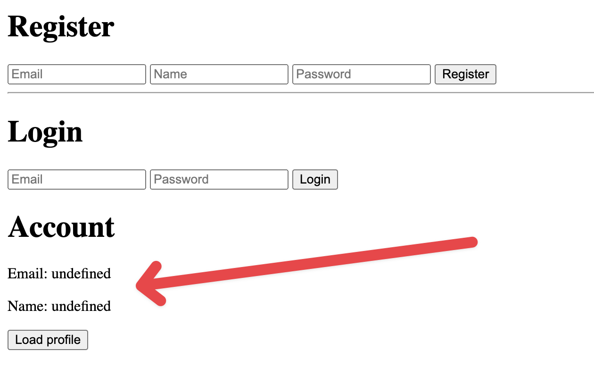
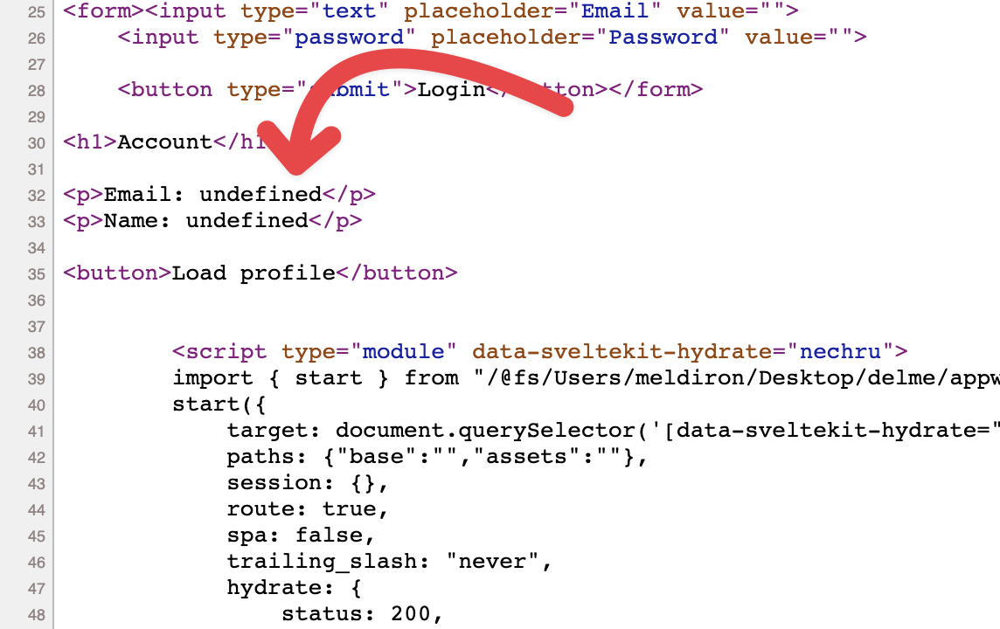
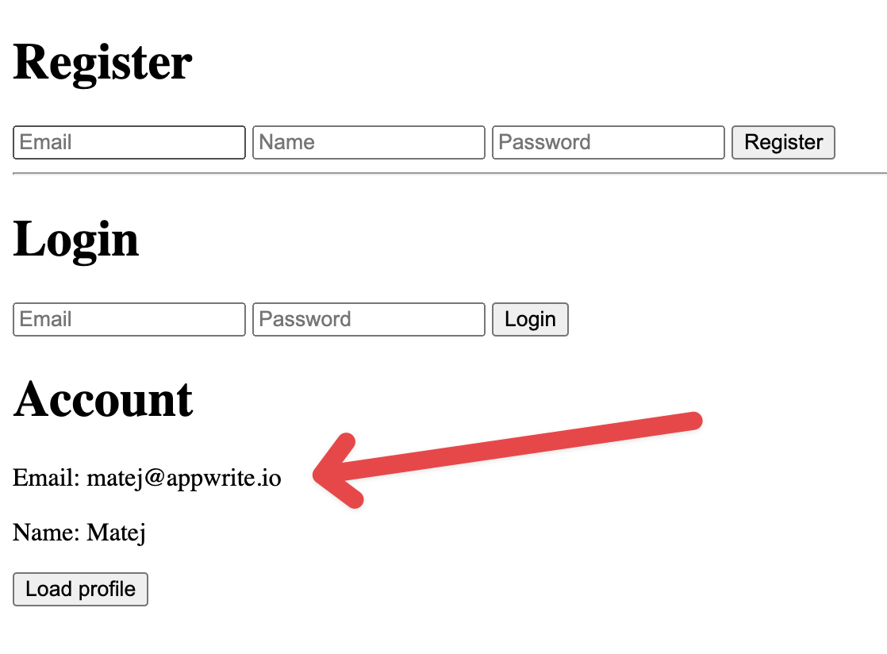
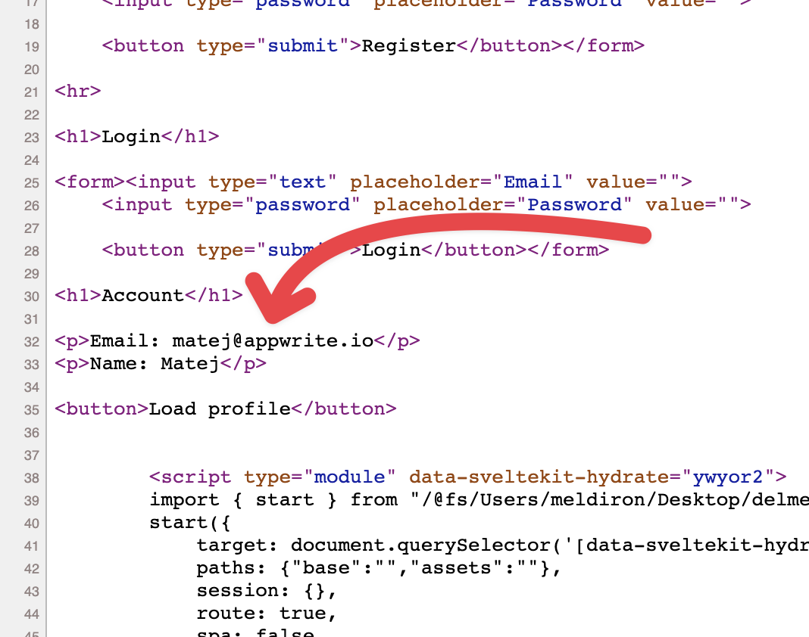

# 🛎️ Appwrite + Svelte Kit (SSR)

This repository is an example of how an SSR can be achieved in Svelte Kit using Appwrite SDK.

The goal of this PoC was to create a website where users can sign in (and register), and view his profile (email and name). The main trick is that SSR needs to be working, so if the client disables JavaScript, his information (only accessible after authentication) will be displayed anyway.

## 🐌 Before implementing SSR





## ⚡ With SSR implemented





## Auto-generated readme:

Everything you need to build a Svelte project, powered by [`create-svelte`](https://github.com/sveltejs/kit/tree/master/packages/create-svelte).

## Creating a project

If you're seeing this, you've probably already done this step. Congrats!

```bash
# create a new project in the current directory
npm init svelte

# create a new project in my-app
npm init svelte my-app
```

## Developing

Once you've created a project and installed dependencies with `npm install` (or `pnpm install` or `yarn`), start a development server:

```bash
npm run dev

# or start the server and open the app in a new browser tab
npm run dev -- --open
```

## Building

To create a production version of your app:

```bash
npm run build
```

You can preview the production build with `npm run preview`.

> To deploy your app, you may need to install an [adapter](https://kit.svelte.dev/docs/adapters) for your target environment.
